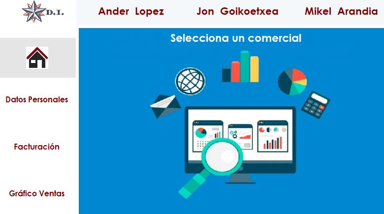

# DI-TE07

<!-- PROJECT LOGO -->
 

  
  <h3 align="center">DashboardMVC</h3>
  

    README de la aplicación DashboardMVC!
     
  

<!-- INDICE -->

  
Indice

  <ol>
    <li><a href="#about">About</a></li>
    <li><a href="#contacto">Contacto</a></li>
    <li><a href="#referencias">Referencias</a></li>
  </ol>

<!-- ABOUT THE PROJECT -->
## About

### Para que sirve esta aplicación ❓

Esta aplicación está pensada para proporcionar los datos de ventas de una empresa. A través de un único dashboard es capaz de mostrar los datos individualizados de los comerciales que trabajan en la empresa.

### A quién está orientada  👥 

Está orientada a cualquier persona de la empresa que necesite conocer los datos de ventas y de facturación del equipo comercial.

## Contacto

Mi nombre es Angel y soy el propietario y fundador de nuestra agencia de diseño de aplicaciones web. Mi equipo y yo creamos Dashboards con un enfoque en la experiencia del usuario. Creamos aplicaciones web atractivas y funcionales al mismo tiempo.

Nuestra experiencia tiene un recorrido de casi 10 años y hemos trabajado con todos, desde la pequeña empresa hasta la empresa Fortune. Queremos ayudar a que la información de la empresa pueda recuperarse de una manera sencilla y atractiva.

Nuestro correo electrónico  amunoz@birt.eus   ✉️

## Referencias

 

